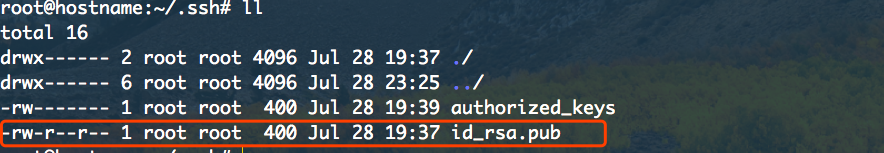
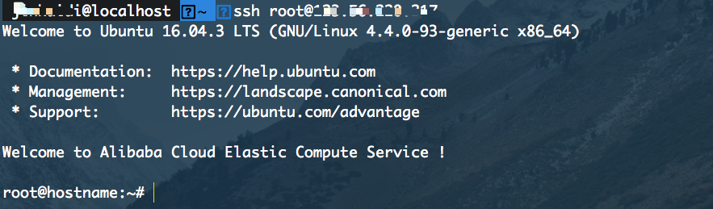

# 关于Ubantu 16.04安装 mongodb的相关介绍（1）

## 这里用的服务器是[阿里云](https://common-buy.aliyun.com/?spm=5176.8142029.735711.10.3dbd6d3eBFK0G4&commodityCode=swas&request=%7B%22region%22:%22cn-beijing%22,%22image_type%22:%22appimage%22,%22app_image%22:%22b2542b3988834a378c67a8d7f11ad4de%22,%22version_type%22:%22version_2%22,%22order_num%22:1,%22ord_time%22:%2212:Month%22,%22auto_renew%22:false%7D#/buy)的服务器

（本教程适用于Linux环境或者Mac os系统）

### 配置ssh免密码登陆

- 首先服务器购买完，大家以后可能会有很多的操作需要在服务器上进行操作，那么每次我都需要通过下面的流程去操作

  ``` bash
  ssh root@xxx.xxx.xx.xx
  # 然后输入密码登陆
  #下面介绍一个简单的操作让我们在自己电脑上不用输入密码就可以登陆自己的服务器。

  ```

  > 生成公私钥（如果已经生成可以跳过）
    ``` shell
    cd ~/.ssh
    ssh-keygen -t rsa
    #然后一路回车就好了
    ```
  > 生成的公钥复制到服务器上~/.ssh/authorized_keys中，使用如下命令：
    ```shell
    scp id_rsa.pub root@xxx.xxx.xx.xx:~/.ssh
    # 输入服务器密码
    ```
  > 然后大家现在需要登陆到自己的服务器上
    ```shell
    cd .ssh
    ll
    # 如下图
    cat id.pub >> authorized_keys
    chmod 600 authorized_keys
    ```
    
  > 新打开一个终端输入
    ```shell
      ssh root@xxx.xxx.xx.xx
    ```
    

### 搞定✌️✌️perfect✌️✌️！！